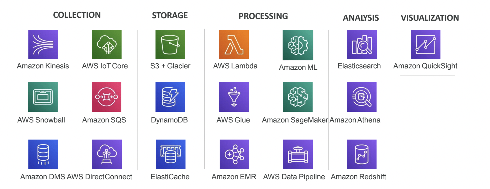

# Data-Engineering-on-AWS
I have created this repository with the purpose of documenting my journey in learning data engineering on AWS as an IT Junior. My intention is to provide a valuable resource for individuals who are beginning their careers in this field. Please feel free to share your feedback and suggestions.

this github repository is divided into 5 sectioms : 
Collection , Storage , Processing , Analysis and Visualization 

# Sections : 

## Section 1 :  Collection

## Section 2 :  Storage 

## Section 3 : Processing 

## Section 4 : Analysis

## Section 5 : Visualization 
